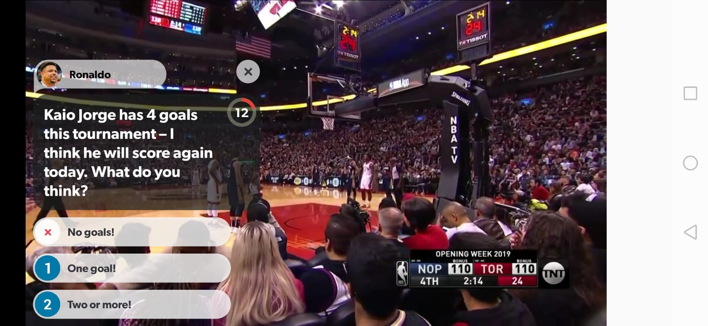
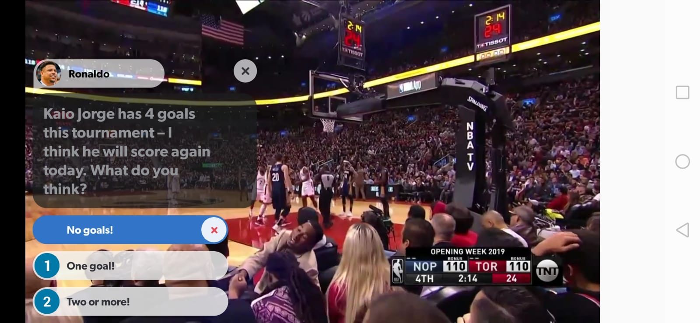

# Sport Buff Up Android SDK

## How to use the SDK
- Add the JitPack repository to your root build.gradle at the end of repositories.
```
allprojects {
    repositories {
        ...
        maven { url 'https://jitpack.io' }
    }
}
```

- Add the dependency to your app build.gradle file.
```
dependencies {
    implementation 'com.github.MahmoudIbrahim3:SportBuffSDK:1.0.0'
}
```

- Rebuild your project.

- Add Buff Up layout to your layout
```
<com.buffup.sdk.BuffUpLayout
    android:layout_width="wrap_content"
    android:layout_height="wrap_content"/>
```

- Finally, run your project and you will see the buff up appears over your video like this:






